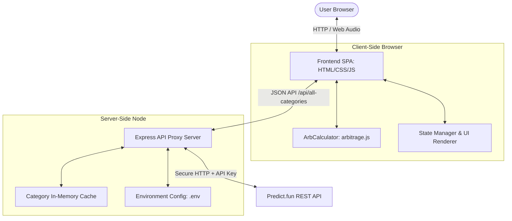

# Betfarm System Architecture

This document describes the system design, components, and data flow of the Predict.fun Opportunity Scanner (`Betfarm`). It is intended for developers, code reviewers, and maintainers looking to understand how the application handles requests, parses outcomes, and calculates risk-free arbitrage opportunities.

---

## 🏗️ Architectural Overview

The application is structured as a decoupled, lightweight client-server system:

### 1. Backend API Proxy (`src/server.js`)

The backend is a thin Express.js server that acts as an intermediary proxy between the frontend client and the official Predict.fun API.

- **Bypass CORS Constraints**: Direct browser requests to the Predict.fun API are blocked by browser Same-Origin Policy (CORS). The proxy handles CORS negotiations.
- **Secure API Key Injection**: The user's `PREDICT_API_KEY` is loaded strictly from the server's `.env` configuration. It is injected into the outgoing headers of Mainnet requests (`x-api-key`), ensuring the secret key is never sent or exposed to the frontend browser.
- **In-Memory Cache Layer**: API requests to category listings are cached for 10 seconds. Since many clients might load the dashboard or trigger simultaneous auto-scans, caching reduces API load and avoids rate limit bans.

### 2. Shared Mathematical Engine (`public/arbitrage.js`)

All arbitrage logic, naming rules, and formatting math are contained in `public/arbitrage.js`.

- **Environment Agnostic**: The file uses a dual-environment export block allowing it to be loaded via standard HTML `<script>` tags on the client, or imported using `require()` in Node.js tests.
- **Pure Functions**: Calculations are deterministic and depend strictly on inputs, making the core scanning algorithms highly testable and robust.

### 3. Frontend SPA Controller (`public/app.js` & `public/index.html`)

Handles all user interactions, range slider event coordination, polling loops, audio chime synthesizers, and DOM rendering.

- **Interval Polling**: Automatically triggers an auto-scan cycle at the matched cache/scan interval configured server-side (retrieved from `/api/config`) via `setInterval`.
- **Persistent State**: The user's preferences (Sort by, Min Profit %, Target Shares, chime toggle) are persisted to browser `localStorage`.
- **Web Audio Chime**: Synthesizes audio tones using the browser's native Web Audio API directly in real-time, removing the need to fetch external `.mp3` assets.

---

## 🧮 Arbitrage Calculation Logic

The mathematical engine processes Predict.fun data to locate three types of arbitrage structures:

### 1. Single Market Binary Arbitrage

Monitors single markets containing exactly two outcomes (YES/NO):
$$\text{Cost } C = P_{\text{yes}} + P_{\text{no}}$$
$$\text{Payout } = 1.00$$
If $C < 1.00$, buy 1 share of YES and 1 share of NO to secure a risk-free return of $\frac{1.00}{C} - 1$.

### 2. Negative Risk YES Arbitrage

Evaluated across $N$ mutually exclusive outcomes in linked `isNegRisk === true` markets within a single category (e.g. Winner of a Soccer Match: Team A, Team B, Draw):
$$\text{Cost } C = \sum_{i=1}^{N} P_{\text{yes}, i}$$
$$\text{Payout } = 1.00 \text{ (since exactly one outcome will resolve to YES)}$$
If $C < 1.00$, buy 1 share of YES on all $N$ outcomes.

### 3. Negative Risk NO Arbitrage

Evaluated across $N$ mutually exclusive outcomes in linked `isNegRisk === true` markets within a category:
$$\text{Cost } C = \sum_{i=1}^{N} P_{\text{no}, i}$$
$$\text{Payout } = N - 1 \text{ (exactly one outcome is YES, causing its NO contract to expire at } 0.00\text{. The remaining } N-1 \text{ outcomes resolve to NO, paying out } 1.00\text{ each)}$$
If $C < N - 1$, buy 1 share of NO on all $N$ outcomes. The profit percentage is:
$$\text{Profit \%} = \left(\frac{N - 1}{C} - 1\right) \times 100$$

---

## 🔬 Core Safeguards & Security Checks

To ensure scanner reliability and execution safety, the system implements the following checks:

### 1. Word-Boundary Regex Naming Parser

Predict.fun outcomes can have names that overlap with outcome choices. For example, Norway is abbreviated as `NOR`. If a parser matches the substring `/no/i`, it will mistake the Norway win contract for the generic `No` hedge contract.

- **Safeguard**: The engine uses strict word boundaries:
  - Yes matches: `/^yes\b/i`
  - No matches: `/^no\b/i`
  - If names do not match, the engine falls back to contract index sets (`indexSet === 1` for YES, `indexSet === 2` for NO).

### 2. Mutual Exclusivity Category Grouping

Arbitrage relies on the mathematical guarantee that only one outcome can happen (probabilities sum to 1). If we group unrelated markets (e.g., handicap bets or total goals), the NegRisk calculations break.

- **Safeguard**: The engine verifies that **all** scanned markets in a category are flagged as `isNegRisk === true` before running multi-leg arbitrage algorithms.

### 3. Liquidity Bottleneck & Slippage Indicators

An arbitrage trade must be executed simultaneously across all legs. If one leg has deep liquidity but another has only 2 shares available, the max execution size is limited to 2.

- **Slippage Safeguard**: The system calculates the maximum executable size:
  $$\text{Bottleneck Depth} = \min_{i} (\text{Size}_i)$$
  If the user-selected **Target Shares** is greater than the **Bottleneck Depth**, the UI displays a warning banner:
  `⚠️ Slippage Risk: Order of X shares exceeds top depth (Y available)`

---

## 🚀 Optimization: Direct Status-Filtering

Fetching all categories from Predict.fun (including historical/resolved markets) results in high payload sizes (1500+ categories) which creates high latency, high memory usage, and potential API rate blocks.

- **Safeguard**: The proxy appends `status=OPEN` to API requests. This cuts the fetched payload down by 75%, allowing faster scans, lower CPU overhead, and 4x faster page loading.
